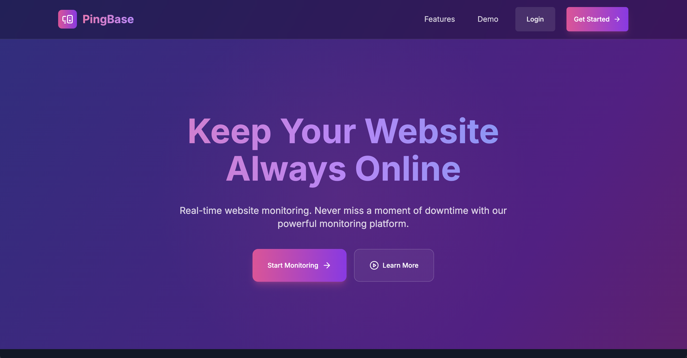
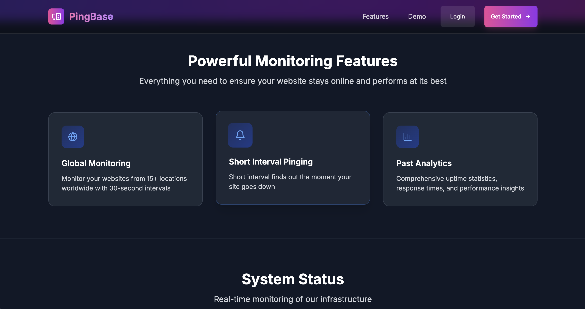
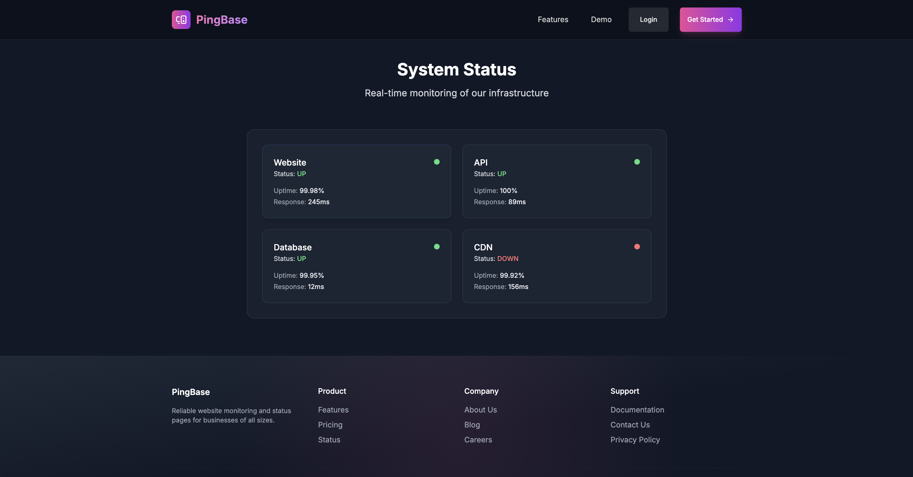
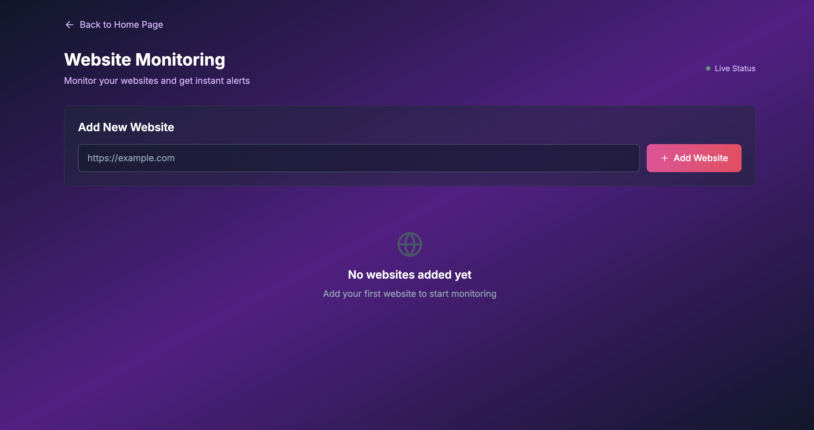
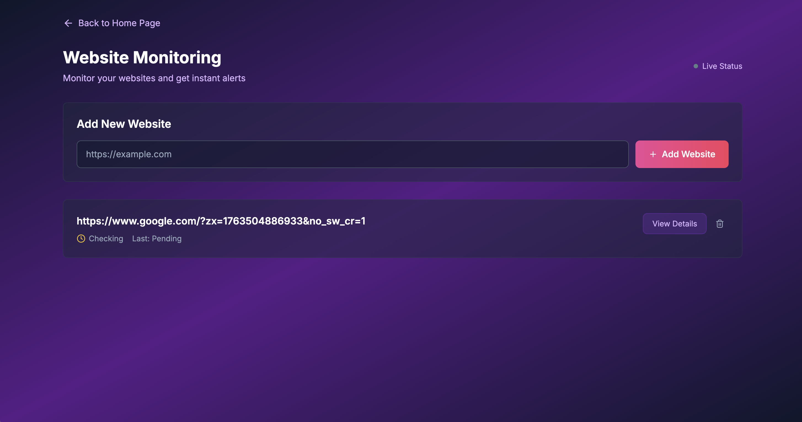
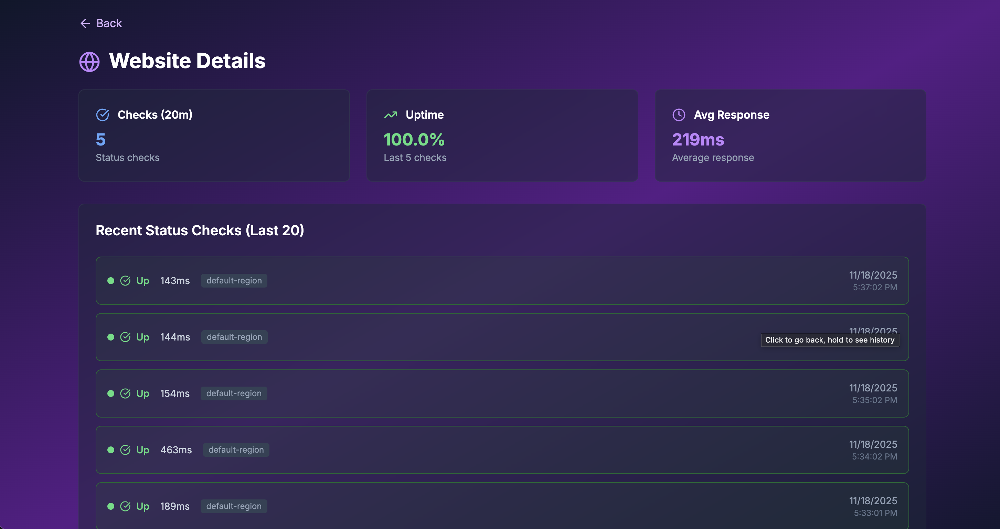

# Pingbase Project

This is the Pingbase project.

---

## Project Preview

Here’s a preview of the project:

<p align="center">
  
  
  
</p>

<p align="center">
  
  
  
</p>

<p align="center">
  
</p>

---

## Getting Started

Follow these steps to set up and run the project locally.

### 1. Install Dependencies

```bash
# Install dependencies for the entire project
npm install
# or
yarn install
# or
pnpm install

# Starts both frontend and backend
npm run dev
# or
yarn dev
# or
pnpm dev

# Run Background Jobs (Scheduler & Worker)
cd apps/apis
npm run scheduler
# or
yarn scheduler
# or
pnpm scheduler

cd apps/apis
npm run worker
# or
yarn worker
# or
pnpm worker


